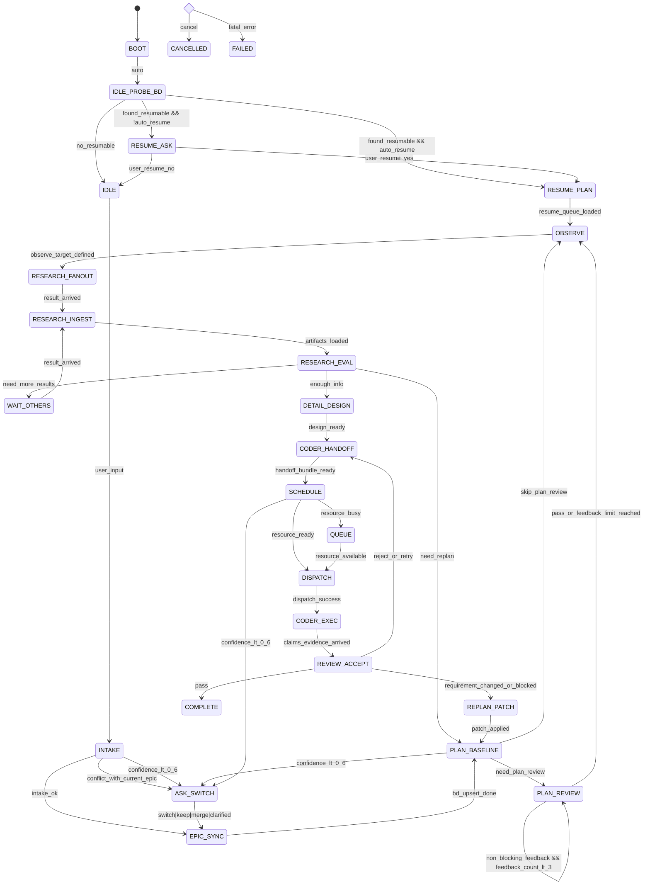

# 编排器状态机 V2（Research-first + Resume Probe）

## 1. 目标

本设计用于统一编排器的基础循环，满足以下约束：

- 启动后 `IDLE` 先自动检查 BD 可恢复任务，并询问用户是否恢复。
- 主循环采用 `Research-first`：先观察与研究，再进入详细设计与编码执行。
- 交付物传递是强契约：research/coder/reviewer/orchestrator 间输入输出固定。
- `confidence < 0.6` 时必须触发澄清或重规划，不直接推进执行。
- reviewer 双模式：执行验收严格证据校验；编排验收默认非阻塞且同项反馈最多 3 轮。

---

## 2. 状态机（V2）

---

## 3. 角色与职责

- `Orchestrator`：任务建模、依赖排序、资源调度、派发、交付物回收、变更管理、用户回传。
- `Research Agent`（原 Searcher）：以“研究执行者”定位，做读和脚本执行，输出研究结论与操作记录。
- `Coder/Executor`：输入必须包含 `master_task + detail_design + research artifacts`，输出 `claims + evidence`。
- `Reviewer`：
  - `executor review`：无证据 claim 必须驳回；有证据需验证是否支撑 claim。
  - `orchestrator review`：默认非阻塞反馈，同项反馈最多 3 轮后自动放行（非关键阻塞场景）。

---

## 4. 交付物契约

### 4.1 Research -> Orchestrator

- `summary.md`（必需）
- `memory.jsonl`（必需，按 agentId 可定位）
- `analysis_meta.json`（建议，结构化元数据）
- `operations.jsonl`（建议，n 个 slot 的操作与结果）

### 4.2 Orchestrator -> Coder

- `master_task.json`
- `detail_design.md`（或等价结构化文件）
- `acceptance_criteria.json`
- `research_bundle[]`：每项至少包含 `{ summary.md, memory.jsonl }`

### 4.3 Coder -> Reviewer

- `claims.json`
- `evidence.json`
- `changed_files.json`

### 4.4 Reviewer -> Orchestrator

- `decision`（`pass|retry|replan`）
- `review_level`（`executor|orchestrator`）
- `rejected_claims[]`
- `residual_risks[]`

### 4.5 Orchestrator -> User

- 阶段结果
- 最终交付清单
- 未决风险与后续建议

---

## 5. Guard 与策略

- `confidence guard`：在 `INTAKE/PLAN_BASELINE/SCHEDULE/REPLAN_PATCH`，`confidence < 0.6` 必进 `ASK_SWITCH`。
- `resume sorting`：恢复队列按 `可执行性(依赖满足) > priority > updatedAt(desc)` 排序。
- `review feedback cap`：`PLAN_REVIEW` 同项非阻塞反馈最多 3 次。
- `claim evidence rule`：`REVIEW_ACCEPT` 中无证据 claim 一律 `reject_or_retry`。

---

## 6. 代码实现拆分（本轮目标）

1. 在 `orchestration app` 层新增独立可测 FSM 核心（`state/event/guard/action`）。
2. 先接入入口循环：`BOOT -> IDLE_PROBE_BD -> RESUME_ASK/RESUME_PLAN -> IDLE/OBSERVE`。
3. 覆盖测试优先验证：
   - resume 分支（ask/no/yes/auto resume）
   - research 回收与充分性评估分支
   - `detail_design -> coder_handoff -> schedule/queue/dispatch -> review -> complete/retry/replan`
4. 后续再替换旧相位循环实现，保持外部事件协议不破坏。

---

## 7. 全 Mock 与逐角色替真调试

推荐先全 mock 跑通流程，再逐角色替换真实 agent。

### 7.1 全 mock 启动

- `FINGER_FULL_MOCK_MODE=1`
- 可选：`FINGER_RUNTIME_DEBUG_MODE=1`（开启 debug runtime modules）
- `gateway` 与 `chat-codex module` 入口保持不变，仅在 `full_mock`（环境变量或 profile）下将 `chat-codex runner` 切为 mock 实现（接口不变）。

### 7.2 按角色替换真实 loop（重启生效）

- `FINGER_MOCK_EXECUTOR_LOOP=0`：executor 使用真实 `finger-executor`
- `FINGER_MOCK_REVIEWER_LOOP=0`：reviewer 使用真实 `finger-reviewer`
- `FINGER_MOCK_SEARCHER_LOOP=0`：searcher 关闭 loop mock（如有真实 finger-researcher 可接入；默认保持 mock）

说明：编排器固定派发到 `finger-executor/finger-reviewer`，因此可以通过上述开关独立替换角色实现。
补充：`chat-codex` 保持同一模块 ID 与协议，mock/real 仅 runner 差异，最大化兼容 UI 和 gateway 链路。

### 7.3 Mock 行为控制（运行时）

- `GET /api/v1/agents/debug/mock-policy`：查看当前 mock 成功/失败策略
- `POST /api/v1/agents/debug/mock-policy`：
  - body: `{ "role": "executor|reviewer|searcher|all", "outcome": "success|failure" }`
  - 用于模拟固定成功/失败，验证重试/重规划分支
