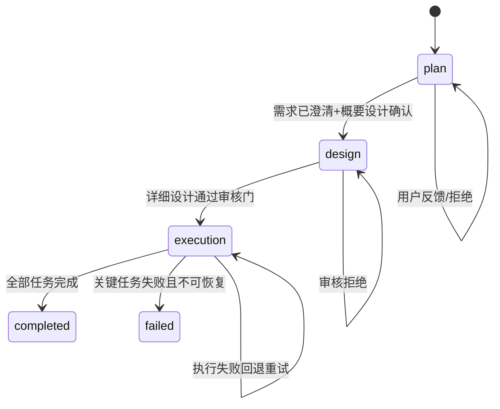

# 资源驱动编排架构 v2

> 目标：基于资源池的多 Epic 并行编排，统一能力抽象，先落地单实例循环，再扩展并行调度

---

## 1. 目标范围

### 1.1 当前落地范围（本阶段）
- 单实例 Epic 执行（串行）
- Loop 生命周期完整落地（Plan/Design/Execution）
- 资源池驱动分配与释放
- 会话上下文边界压缩（双条件触发）
- 对 UI 输出稳定事件协议

### 1.2 预留范围（后续）
- n 个 Epic 并行调度
- 跨 Epic 资源抢占/公平分配
- 多会话快速切换与热恢复

---

## 2. 资源即能力（标准抽象）

```typescript
interface Capability {
  id: string;
  type: string;
  level: number;
  inputSchema: JSONSchema;
  outputSchema: JSONSchema;
  metadata?: Record<string, unknown>;
}

interface ResourceInstance {
  id: string;
  name: string;
  type: 'executor' | 'orchestrator' | 'reviewer' | 'tool' | 'api' | 'database';
  capabilities: Capability[];
  status: 'available' | 'deployed' | 'busy' | 'blocked' | 'error';
  currentSessionId?: string;
  currentWorkflowId?: string;
  currentTaskId?: string;
}
```

### 2.1 统一能力目录接口

```typescript
resourcePool.getCapabilityCatalog(): Array<{
  capability: string;
  resourceCount: number;
  availableCount: number;
  resources: Array<{ id: string; name: string; level: number; status: ResourceStatus }>;
}>
```

约束：
- 编排必须基于能力目录分配任务
- 资源不足必须显式回报用户，不可静默失败

---

## 3. Epic 生命周期与循环

### 3.1 三阶段状态机



### 3.2 Plan 阶段
- 输入：用户任务文本
- 输出：概要设计（可用户确认）
- 节点：`user -> orch -> review -> user`
- 退出条件：用户确认完成

### 3.3 Design 阶段
- 输入：Plan 输出
- 输出：可执行任务清单（task queue）
- 节点：`orch -> review_gate -> orch`
- 退出条件：审核门通过

### 3.4 Execution 阶段
- 输入：task queue
- 输出：任务结果与交付物
- 节点：`orch -> exec -> review -> orch`
- 关键：每个 exec 节点都必须先分配资源

---

## 4. 资源池驱动执行规则

### 4.1 分配规则
1. 任务声明所需能力（requiredCapabilities）
2. 能力映射到资源需求（ResourceRequirement）
3. `allocateResources(taskId, requirements)`
4. 分配成功后任务进入执行

### 4.2 释放规则
- 完成：`releaseResources(taskId, 'completed')`
- 失败：`releaseResources(taskId, 'failed')`
- 阻塞：`releaseResources(taskId, 'blocked')`

### 4.3 关键约束
- 编排 agent 本身也是资源
- 空闲编排 agent 才可承接新循环
- 资源缺失要抛出结构化错误并推送事件

---

## 5. 会话与上下文压缩

### 5.1 会话绑定
- 每个资源执行时绑定 `sessionId` 与 `workflowId`
- 资源切换前先保存当前会话上下文

### 5.2 压缩触发（已定）
双条件触发：
1. 循环完成（cycle complete）
2. token 超阈值（usedTokens > compressionThreshold）

```typescript
if (cycleCompleted && usedTokens > threshold) {
  compressContext();
}
```

### 5.3 压缩策略
- 保留最近 2 个循环原文
- 其余历史摘要化
- 保留关键决策、失败原因、产出路径

---

## 6. 事件协议（系统边界）

### 6.1 Loop 事件
- `loop.created`
- `loop.started`
- `loop.node.updated`
- `loop.node.completed`
- `loop.completed`
- `loop.queued`

### 6.2 Epic 事件
- `epic.phase_transition`
- `epic.user_input_required`
- `epic.created`
- `epic.completed`

### 6.3 Resource 事件
- `resource.allocated`
- `resource.released`

### 6.4 Context 事件
- `context.compressed`

---

## 7. 接口分层与解耦

### 7.1 Backend 核心模块
- `src/orchestration/resource-pool.ts`：资源池事实来源
- `src/orchestration/loop/types.ts`：循环领域模型
- `src/orchestration/loop/events.ts`：循环事件协议
- `src/orchestration/loop/loop-manager.ts`：循环生命周期引擎

### 7.2 Agent 接入点
- `finger-orchestrator`：负责 phase 决策和循环推进
- `finger-executor`：负责执行节点与资源使用回报

约束：执行器不直接操控全局 phase，只通过事件与结果反馈驱动

---

## 8. 并行 Epic 预留设计

### 8.1 调度接口

```typescript
interface EpicScheduler {
  mode: 'serial' | 'parallel';
  scheduleNext(): string | undefined;
}
```

### 8.2 后续扩展点
- maxConcurrentEpics
- fair/priority/demand-based 调度策略
- 资源配额与抢占策略

当前默认：`mode = 'serial'`

---

## 9. 对 UI 的契约要求

UI 不推导核心状态，只消费事件与状态快照：
- Canvas：按 loop + node 渲染
- Chat：按 loop 分组显示时间线
- Resource Panel：显示当前占用与释放记录

---

## 10. 验收标准

### 10.1 后端
- 单 Epic 三阶段可跑通
- 资源分配/释放全链路可观测
- 缺资源可结构化回报
- 上下文压缩触发可记录

### 10.2 前端
- 三区分区能实时反映 loop 生命周期
- 对话面板按 loop 分组显示消息
- 用户输入能推动 plan 阶段循环

---

> 本文档与 `task-flow-canvas-v12.md` 对齐，作为非 UI 核心循环与资源编排的统一设计基线。
