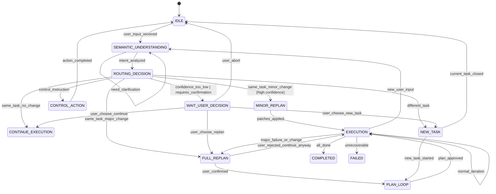
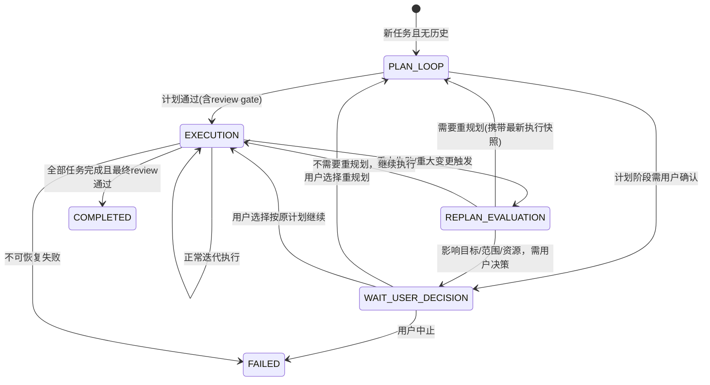
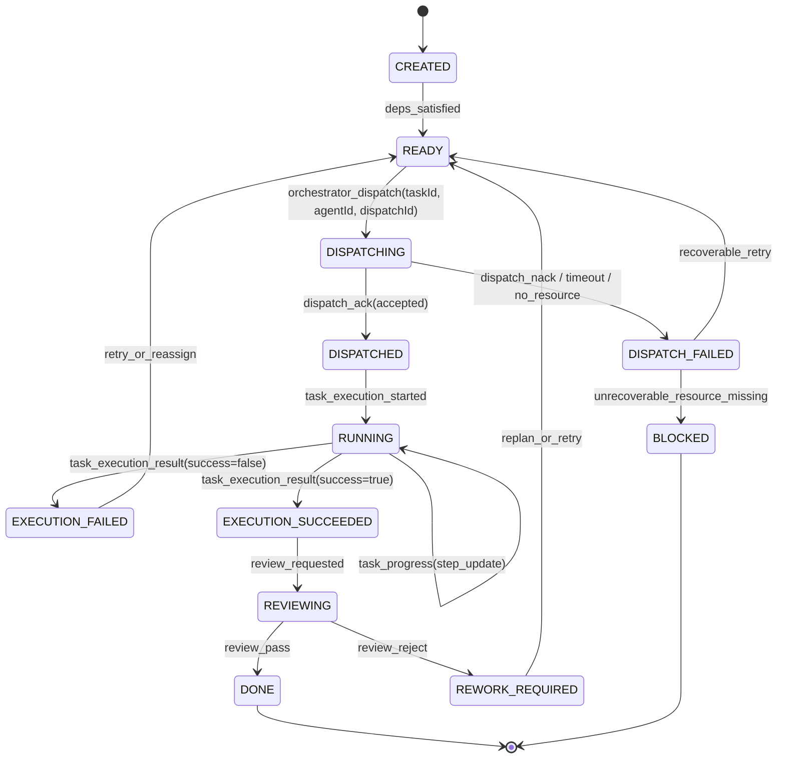
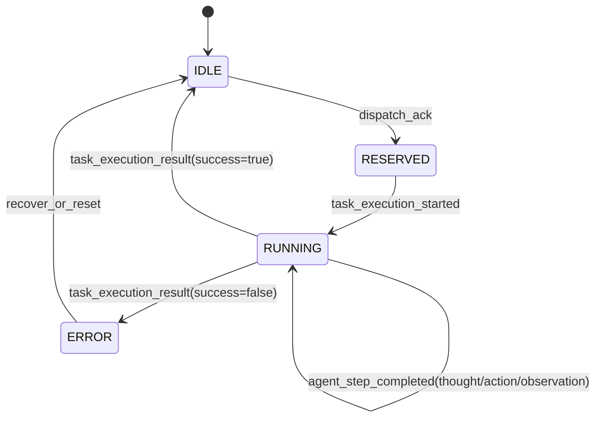
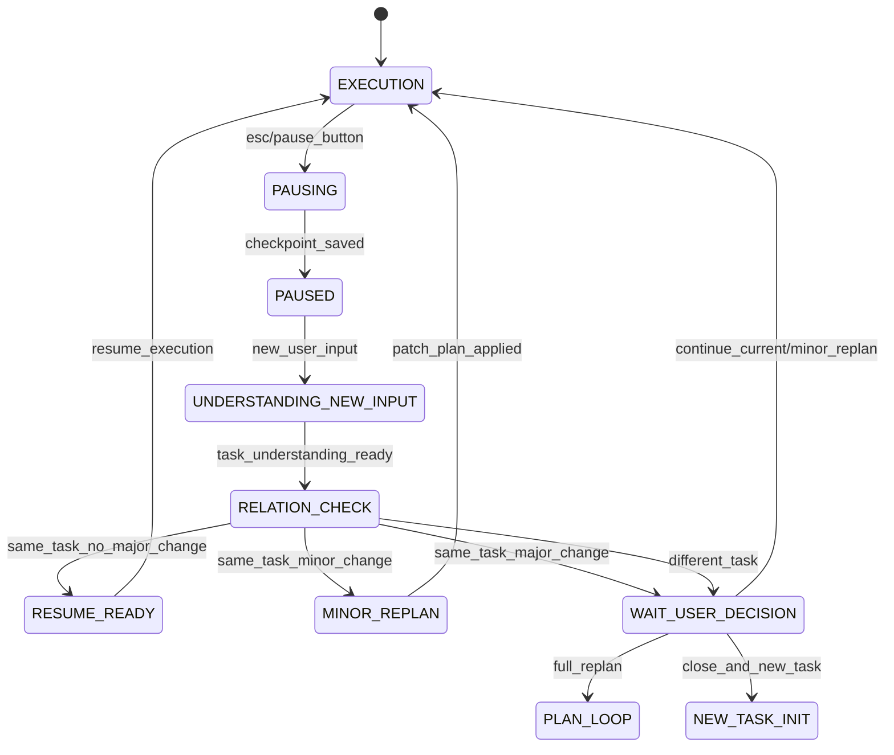

# 用户输入语义理解与路由设计

## 1. 概述

所有用户输入必须先经过**语义理解阶段**，再进入路由决策，最后才进入具体业务执行。不同阶段的 Agent 使用不同的提示词。

## 2. 阶段流程

```
用户输入 → 语义理解阶段 → 路由决策阶段 → 业务执行阶段
```

## 3. 状态机总览



## 4. 整体任务状态机（Workflow FSM）



## 5. 任务状态机（Task FSM）



## 6. Agent 状态机（Agent FSM）



## 7. 中断与重指令状态机



## 8. 数据结构定义

### 8.1 语义理解输入

```typescript
interface SemanticUnderstandingInput {
  rawInput: string;
  images?: RuntimeImage[];
  
  // 当前系统状态
  systemState: {
    workflowStatus: 'idle' | 'plan_loop' | 'execution' | 'paused' | 'completed' | 'failed';
    currentTask?: {
      goal: string;
      progress: number;
      completedTasks: number;
      failedTasks: number;
      blockedTasks: number;
    };
    lastActivity: string;
    availableResources: string[];
  };
  
  // 历史记录
  recentHistory: Array<{
    role: 'user' | 'agent';
    content: string;
    timestamp: string;
  }>;
}
```

### 8.2 语义理解输出（IntentAnalysis）

```typescript
interface IntentAnalysis {
  // 标准化意图
  normalizedIntent: {
    goal: string;
    action: 'create' | 'modify' | 'query' | 'cancel' | 'continue' | 'clarify';
    scope: 'full_task' | 'partial_task' | 'meta_control';
    urgency: 'high' | 'medium' | 'low';
  };
  
  // 与当前任务关系
  taskRelation: {
    type: 'same_task_no_change' 
         | 'same_task_minor_change' 
         | 'same_task_major_change' 
         | 'different_task'
         | 'control_instruction';
    confidence: number;  // 0-1
    reasoning: string;
  };
  
  // 上下文依赖
  contextDependency: {
    needsCurrentTaskContext: boolean;
    needsExecutionHistory: boolean;
    needsResourceStatus: boolean;
    referencedEntities: string[];
  };
  
  // 建议路由
  suggestedRoute: {
    nextPhase: 'plan_loop' | 'execution' | 'replan' | 'new_task' | 'wait_user' | 'control';
    reason: string;
    requiresUserConfirmation: boolean;
  };
}
```

### 8.3 路由决策输出（RoutingDecision）

```typescript
interface RoutingDecision {
  route: 'continue_execution' 
       | 'minor_replan' 
       | 'full_replan' 
       | 'new_task' 
       | 'control_action'
       | 'wait_user_decision';
       
  confidence: number;
  
  payload?: {
    planPatches?: PlanPatch[];
    controlAction?: 'pause' | 'resume' | 'cancel' | 'status_query';
    newTaskJustification?: string;
    replanTrigger?: string;
  };
  
  userConfirmationRequired: boolean;
  userMessage: string;
}
```

### 8.4 任务关系评估（TaskRelationAssessment）

```typescript
interface TaskRelationAssessment {
  relationType: 'same_task_no_major_change' 
               | 'same_task_minor_change' 
               | 'same_task_major_change' 
               | 'different_task';
  
  reasoning: string;
  confidence: number;
  
  assessment: {
    goalSimilarity: number;
    scopeDelta: 'none' | 'minor' | 'major';
    constraintDelta: 'none' | 'minor' | 'major';
    deliverableDelta: 'none' | 'minor' | 'major';
    resourceImpact: 'none' | 'minor' | 'major';
    timelineImpact: 'none' | 'minor' | 'major';
  };
  
  recommendedAction: 'continue' | 'minor_replan' | 'full_replan' | 'new_task';
  replanRationale?: string;
  newTaskJustification?: string;
}
```

## 9. UI 事件时间线

用户必须能在对话面板看到以下事件（按顺序）：

1. `user_input_received` - "收到用户输入"
2. `semantic_understanding_started` - "正在理解用户意图..."
3. `semantic_understanding_completed` - 显示分析结果
4. `routing_decision_made` - 显示路由决策
5. `user_confirmation_required` - 等待用户选择（如需要）
6. `phase_transition` - 进入具体业务阶段
7. `task_dispatch_requested` - "编排器派发任务到 xxxloop.xxxrole"
8. `task_dispatch_ack/nack` - "接单成功/派发失败"
9. `task_execution_started` - "开始执行"
10. `agent_step_completed` - 显示 thought/action/observation
11. `task_execution_result` - "执行成功/执行失败"
12. `task_review_result` - "审核通过/驳回"

## 10. 派发握手协议

### 10.1 派发流程

```
orchestrator → executor: task_dispatch_requested(taskId, agentId, dispatchId)
executor → orchestrator: task_dispatch_ack(dispatchId) | task_dispatch_nack(dispatchId, reason)
```

### 10.2 判定规则

- **DISPATCH_FAILED**: Agent 尚未开始执行，失败发生在"接单前/接单时"
- **EXECUTION_FAILED**: Agent 已开始执行，失败发生在"执行中/执行后"

### 10.3 超时处理

- 派发超时（默认 30s）视为 `dispatch_nack(timeout)`
- 记录到 Agent 错误计数

## 11. 落盘字段

```typescript
interface WorkflowState {
  workflowStatus: 'plan_loop' | 'execution' | 'replan_evaluation' | 'wait_user_decision' | 'completed' | 'failed';
  replanReason?: 'major_failure' | 'major_change' | 'resource_missing' | 'review_reject';
  decisionRequired: boolean;
  decisionOptions: string[];
  latestExecutionSnapshotId: string;
  currentIntentAnalysis?: IntentAnalysis;
  currentRoutingDecision?: RoutingDecision;
}
```

## 12. 角色显示规范

- 展示名统一：`{loopId}.{role}`
- 例子：
  - `finger-orchestrator.planner`
  - `finger-executor.executor`
  - `finger-orchestrator.reviewer`
- 后端事件必须带 `loopId` + `role`，前端不再猜测

## 13. 参考文件

- 提示词定义: [docs/design/agent-prompts.md](./agent-prompts.md)
- Agent 角色体系: [docs/AGENT_ROLES.md](../AGENT_ROLES.md)
- Agent Context 设计: [docs/AGENT_CONTEXT_DESIGN.md](../AGENT_CONTEXT_DESIGN.md)
- 状态机实现: `src/orchestration/workflow-fsm.ts`（待创建）
