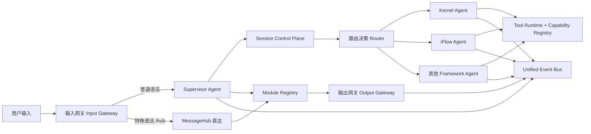

# SuperAgent 会话与能力治理设计（V1）

> 目标：让 Finger 以“主会话控制子 Agent 会话”的方式统一运行，支持同一内核下接入基础模型与框架型 Agent（如 iFlow），并把工具能力治理、I/O 网关与事件协议收敛到同一套抽象。

## 1. 设计目标与边界

## 1.1 目标
- 主会话统一管理上下文与路由状态，子 Agent 维护独立 provider session。
- Agent 统一抽象：上层调用一致，底层实现可不同（kernel/model/framework）。
- 工具治理统一在 Runtime 层执行，支持角色策略与授权令牌。
- 默认入口走 Supervisor Agent，保留 MessageHub 显式直达语法。
- 输出强制结构化，支持校验/掩码/修补/重试。

## 1.2 非目标（V1 不做）
- 不做跨集群分布式会话同步。
- 不做长期向量记忆系统。
- 不做复杂多租户隔离策略（仅本机单用户优先）。

## 2. 术语定义

- `fingerSessionId`：主会话 ID，Finger 运行时的唯一上下文主键。
- `agentSessionId`：子 Agent 在某 provider 的会话 ID。
- `providerSessionId`：与 `agentSessionId` 等价，强调 provider 侧语义。
- `Session Control Plane`：主会话与子会话映射、上下文快照、生命周期管理层。
- `Capability`：可调用能力，通常映射为 CLI 命令或内部工具。

## 3. 总体架构



## 4. 会话控制平面（核心）

## 4.1 会话模型

```typescript
interface MainSession {
  fingerSessionId: string;
  title?: string;
  createdAt: string;
  updatedAt: string;
  status: 'active' | 'paused' | 'completed' | 'error';
  metadata?: Record<string, unknown>;
}

interface AgentSessionBinding {
  fingerSessionId: string;
  agentId: string;
  provider: 'kernel' | 'iflow' | 'codex' | string;
  role?: string;
  providerSessionId: string;
  updatedAt: string;
}

interface SessionRoutingState {
  fingerSessionId: string;
  lastRoute?: {
    target: string;
    decision: 'direct_reply' | 'dispatch_agent' | 'dispatch_module' | 'ask_human' | 'reject';
    confidence: number;
    timestamp: string;
  };
  capabilitySnapshotVersion: string;
}
```

## 4.2 存储布局

- `~/.finger/sessions/<fingerSessionId>/session.json`：主会话元数据。
- `~/.finger/sessions/<fingerSessionId>/messages.jsonl`：主会话消息流。
- `~/.finger/sessions/<fingerSessionId>/agent-sessions.json`：子会话映射表。
- `~/.finger/iflow-session-map.json`：兼容层（V1 保留，V2 合并进 `agent-sessions.json`）。

## 4.3 生命周期

1. 收到用户输入，解析是否直达 MessageHub。
2. 普通输入进入 Supervisor，读取 `fingerSessionId`。
3. Router 决策目标 `agentId`。
4. Session Control Plane 按 `(fingerSessionId, agentId)` 查子会话：
- 命中：`loadSession(providerSessionId)`
- 未命中：`newSession()` + 绑定写入
5. 执行后回写路由状态、事件和摘要。

## 5. Agent 统一抽象与组合

## 5.1 统一接口

```typescript
interface UnifiedAgent {
  id: string;
  role: string;
  provider: string;
  initialize(ctx: AgentInitContext): Promise<void>;
  handle(input: UnifiedAgentInput, ctx: AgentRunContext): Promise<UnifiedAgentOutput>;
  health(): Promise<{ ok: boolean; detail?: string }>;
  shutdown(): Promise<void>;
}
```

## 5.2 组合模型

- `SupervisorAgent`：轻量总管，负责语义判断与路由，不承担重度执行。
- `WorkerAgent`：执行型智能体（kernel/iflow 等）。
- `SuperAgent`：可嵌套容器，内部编排多个 Worker，但对外仍是 `UnifiedAgent`。

## 5.3 反自锁约束

- `execution_chain` 检测循环调用。
- `nesting_depth <= maxDepth`（默认 4）。
- 每次调用发放 `lease_id` + `ttl`，超时强制回收。

## 6. 能力与工具治理

## 6.1 治理层级（从低到高）

1. 全局策略（系统默认）
2. 角色策略（reviewer/executor/orchestrator）
3. Agent 策略（`agent.json`）
4. 单次请求策略（临时 allow/deny）

最终策略 = 上层覆盖下层，`deny` 优先于 `allow`。

## 6.2 工具执行链

1. Agent 请求调用工具。
2. Runtime 校验白名单/黑名单。
3. 若要求授权，验证 token（TTL + maxUses）。
4. 执行工具并发布 `tool_call/tool_result/tool_error` 事件。

## 6.3 能力注册（CLI 模式）

- 每个能力目录包含：
  - `module.json`（描述、命令、探测参数）
  - `README.md`（用途与场景）
  - `cli.md`（命令细节）
- 运行时通过 `capability inspect` 分阶段披露（L1/L2/L3）。

## 7. 配置模型

## 7.1 用户配置（统一）

- 文件：`~/.finger/config.json`
- 用途：端口、默认 provider、全局策略、默认路由与开关。

## 7.2 系统模块配置（统一）

- 文件：`module.json`
- 用途：模块/能力声明、加载方式、健康检查、I/O 模式。

## 7.3 agent.json 扩展（V1）

```json
{
  "id": "executor-1",
  "role": "executor",
  "provider": {
    "type": "iflow",
    "model": "gpt-5.3-codex"
  },
  "session": {
    "bindingScope": "finger+agent",
    "resume": true
  },
  "tools": {
    "whitelist": ["shell.exec", "capability.bd"],
    "blacklist": ["file.delete"],
    "authorizationRequired": ["shell.exec"]
  },
  "governance": {
    "iflow": {
      "allowedTools": ["read_file", "write_file"],
      "disallowedTools": ["network"],
      "approvalMode": "default",
      "injectCapabilities": true,
      "commandNamespace": "cap_"
    }
  }
}
```

## 8. I/O 网关抽象

## 8.1 目标

- 输入/输出统一走“可注册 CLI 网关”。
- 支持同步阻塞和异步通知两种模式。
- UI 与 daemon 通信走同一协议层，WebSocket 仅作为传输实现之一。

## 8.2 网关契约

```typescript
interface GatewayModule {
  id: string;
  direction: 'input' | 'output' | 'duplex';
  mode: 'sync' | 'async';
  protocol: 'stdio' | 'http' | 'websocket';
  start(): Promise<void>;
  stop(): Promise<void>;
  send(message: GatewayMessage): Promise<GatewayResult | void>;
}
```

## 8.3 本地通信方式

- 默认采用 CLI daemon + `stdin/stdout` 协议。
- gateway worker 作为常驻进程注册到 daemon。
- 对 UI 的高级展示通过事件协议驱动，不耦合具体前端实现。

## 9. 事件与可观测性

## 9.1 必备事件

- `SESSION`: `session_created`, `session_bound`, `session_resumed`
- `PHASE`: `route_decided`, `dispatch_sent`, `dispatch_result`
- `TOOL`: `tool_call`, `tool_result`, `tool_error`
- `HUMAN_IN_LOOP`: `ask_human`, `approval_required`
- `SYSTEM`: `guardrail_failed`, `policy_rejected`

## 9.2 关键字段

- `fingerSessionId`
- `agentId`
- `providerSessionId`
- `requestId`
- `routeDecision`

## 10. 输出 Guardrail

1. 提取 JSON 段落。
2. Schema 校验。
3. 字段掩码（白名单）。
4. 结构修补（补齐缺失字段）。
5. 修补失败重试（最多 2 次）。
6. 仍失败 -> `ask_human` 或 `reject`。

## 11. 迁移计划（从现状到 V1）

## Phase 0（已落地）
- iFlow 工具治理与 capability 注入基础能力。
- `fingerSessionId -> iflowSessionId` 映射能力。

## Phase 1（P0）
- 扩展为 `fingerSessionId + agentId -> providerSessionId` 多映射。
- Session Control Plane API 抽象化（provider 无关）。

## Phase 2（P0）
- `agent.json` 扩展到 provider/session/governance 字段并接入 daemon。
- 统一 chat/chat-codex 到同一 `UnifiedAgent` 路径。

## Phase 3（P1）
- I/O gateway CLI 全量接管输入输出。
- UI 对话面板消费统一事件协议（含工具与路由事件）。

## Phase 4（P1）
- 端到端回放测试与错误路径重放固化。

## 12. 验收标准

- 同一 `fingerSessionId` 下，至少两个子 Agent 可以绑定并复用各自 session。
- 工具黑白名单和授权令牌在 Runtime 层统一生效。
- `agent.json` 变更后无需重编译即可生效（daemon reload）。
- UI 面板可看到路由、工具、回复三类事件。
- 失败路径可重放并得到一致错误分类。

## 13. 风险与缓解

- 风险：老链路与新链路并存导致行为漂移。
  - 缓解：入口灰度开关 + 双写事件比对。
- 风险：provider session 不可恢复。
  - 缓解：映射失效时自动新建并发告警事件。
- 风险：工具注入过多造成上下文膨胀。
  - 缓解：分阶段披露 + 上下文预算裁剪。

